## 产品概述

在现有GAS战斗框架之上构建一套完整的塔防玩法系统。玩家自由移动于战场地图，守护主城不受NPC敌人侵袭，通过建造防御塔和释放技能来抵御沿预设路径进攻的多波敌人。

## 核心功能

- **NPC敌人生成与路径跟随**：敌人沿编辑器预设的WaypointPath向主城移动，支持多种敌人类型，通过对象池管理生命周期
- **主城防御与血量系统**：主城具有独立血量和防御属性，承受敌人到达后的攻击伤害，血量归零判定失败
- **防御塔系统**：玩家在地图指定位置建造箭塔/炮塔，防御塔自动锁定范围内最近敌人进行攻击，支持升级
- **玩家移动与技能**：玩家角色在地图上自由移动，可释放已有的GAS近战/远程技能参与战斗
- **波次管理与Boss**：支持多波敌人配置（ScriptableObject），可定义Boss波次，波间有准备时间
- **战斗事件与回放**：完整复用现有BattleEventBus和BattleRecord/Playback回放系统，新增TD专属事件类型

## 技术架构

### 整体架构图

```mermaid
graph TB
    subgraph BattleFoundation["BattleFoundation (框架层 - 不修改)"]
        BE["BattleEngine (abstract)"]
        BC["BattleContext"]
        EM["EntityManager"]
        EB["BattleEventBus"]
        SM["BattleSystemManager"]
        RL["BattleRuleBase"]
        RP["BattleRecord / Playback"]
    end

    subgraph GAS_Core["GAS核心 (不修改)"]
        GAS["GameplayAbilitySystem"]
        AS["AttributeSet / Modifier"]
        GE["GameplayEffect"]
        AB["Ability / Task / Cue"]
    end

    subgraph TD_Layer["TowerDefense 模块 (新增)"]
        direction TB
        
        subgraph Engine["引擎层"]
            TDE["TDBattleEngine extends BattleEngine"]
            TDC["TDBattleContext extends BattleContext"]
        end
        
        subgraph Systems["System层 (IBattleSystem)"]
            PS["PathFollowerSystem"]
            WMS["WaveManagerSystem"]
            TPS["TowerPlacementSystem"]
            MCS["MainCitySystem"]
            TES["TDEventSystem"]
        end
        
        subgraph Entities["实体层"]
            PLR["TDPlayerActor extends CombatActor"]
            NPC["TDEnemyActor extends CombatActor"]
            TWR["TowerActor extends BattleEntity"]
            MC["MainCityActor extends BattleEntity"]
        end
        
        subgraph Components["组件层"]
            PFC["PathFollowerComponent"]
            TAC["TowerAttackComponent"]
            TBC["TowerBuilderComponent"]
            MHC["MainCityHealthComponent"]
        end
        
        subgraph Rules["规则层"]
            TDR1["MainCityDestroyedRule"]
            TDR2["AllWavesClearedRule"]
            TDR3["PlayerDeathRule"]
        end

        subgraph Data["数据层"]
            WP["WaypointPath (SO)"]
            WC["WaveConfig (SO)"]
            TC["TowerConfig (SO)"]
            EC["TDEnemyConfig (SO)"]
            MCC["MainCityConfig (SO)"]
        end
    end

    TDE --extends--> BE
    TDC --extends--> BC
    TDE --> TDC
    TDE --> PS & WMS & TPS & MCS & TES
    TDE --> TDR1 & TDR2 & TDR3
    
    PLR --reuses--> CombatActor
    NPC --reuses--> CombatActor
    NPC --> PFC
    
    TWR --> TAC
    MC --> MHC
    
    PS --> PFC
    WMS --> NPC
    TPS --> TBC
    TPS --> TWR
    MCS --> MC
    
    ALL --uses--> GAS
    ALL --uses--> EM
    ALL --uses--> EB
```



### 模块划分与数据流

#### 1. TDBattleEngine（战斗引擎入口）

- 继承 `BattleEngine`，重写 `OnInitialize()` 注册所有TD System和Rule
- 重写 `OnUpdate(float)` 处理TD全局Tick逻辑
- 重写 `OnBattleStart()` 初始化波次、生成主城
- 通过 `CreateContext()` 返回 `TDBattleContext` 实例

#### 2. TDBattleContext（战斗上下文）

- 继承 `BattleContext`，扩展TD专属服务访问（如 `WaveManager`, `TowerRegistry`）
- 复用 `EntityManager` 管理所有TD实体的对象池

#### 3. 路径系统

- **WaypointPath**: ScriptableObject，存储 `Vector3[]` 路点数组，编辑器可视化编辑
- **PathFollowerSystem** (IBattleSystem): 批量更新所有 `PathFollowerComponent`，统一Tick避免分散Update
- **PathFollowerComponent** (EntityComponent): 挂载于TDEnemyActor，持有WaypointPath引用，每帧沿路径移动，到达终点时触发 `EnemyReachedEndEvent`

#### 4. 波次系统

- **WaveConfig** (SO): 定义 `WaveData[]`，每个WaveData含敌人类型、数量、生成间隔、波前延迟
- **WaveManagerSystem** (IBattleSystem): 管理波次状态机（Preparing → Spawning → Active → Cleared），通过 `EnemyFactory` 从对象池获取敌人并初始化到路径起点
- **Boss支持**: WaveData中 `IsBoss` 标记，Boss生成时附带特殊Buff/属性加成

#### 5. 主城系统

- **MainCityActor** 继承 `BattleEntity`，挂载 `MainCityHealthComponent`，拥有 `IGameplayAttributeOwner` 接口
- **MainCityHealthComponent**: 封装血量逻辑，接收 `DamageEvent`，HP归零时触发 `MainCityDestroyedEvent`
- **MainCityDestroyedRule**: 监听 `MainCityDestroyedEvent`，触发 `EndBattle(EBattleResult.Fail)`

#### 6. 防御塔系统

- **TowerActor** 继承 `BattleEntity`（静态实体，不需要移动组件），挂载 `TowerAttackComponent` 和GAS属性组件
- **TowerAttackComponent**: 实现 `ICombatTarget` 查询接口，每AttackInterval在 `atkRange` 内查找最近 `TDEnemyActor`，调用现有 `CombatDamageExecution` 计算伤害
- **TowerBuilderComponent**: 玩家输入处理，Raycast检测可建造区域，消耗资源创建TowerActor
- **TowerPlacementSystem** (IBattleSystem): 管理可建造网格、建造预览、升级逻辑

#### 7. 玩家系统

- **TDPlayerActor** 继承 `CombatActor`，复用 `CombatMovementComponent` 支持摇杆/点击移动
- 复用已有的 `MeleeAttackAbility` / `RemoteAttackAbility`，通过输入映射触发技能
- `TDPlayerMovementSystem`: 处理玩家移动输入（摇杆、点击地面NavMesh寻路）

#### 8. 敌人系统

- **TDEnemyActor** 继承 `CombatActor`，挂载 `PathFollowerComponent` 和简化的 `CombatAI`（寻路+攻击主城/防御塔）
- **EnemyFactory**: 封装对象池逻辑，通过 `EntityManager` 分配/回收敌人实例，支持预创建池

#### 9. 事件与回放

- **TDEventTypes**: 定义TD专属事件ID（`WaveStarted`, `WaveCleared`, `EnemySpawned`, `EnemyKilled`, `EnemyReachedEnd`, `TowerBuilt`, `TowerUpgraded`, `MainCityDamaged`, `MainCityDestroyed`, `BossSpawned`）
- **TDEventSystem**: 收集关键战斗数据（击杀数、剩余血量、波次进度），供UI和回放使用
- 完全复用 `BattleRecorder` / `BattlePlayback`：TD实体状态通过 `IBattleReplayAdapter` 序列化，FrameRecordData自动录制

### 实现细节

#### 性能策略

- **对象池**: TDEnemyActor 和 TowerActor 通过 `EntityManager` 的对象池管理，避免运行时 Instantiate/Destroy
- **集中Tick**: PathFollower、TowerAttack、WaveSpawner 均通过 System 统一Update，不使用 MonoBehaviour.Update
- **目标查询优化**: TowerAttackComponent 使用空间哈希或按距离排序缓存，避免每帧全量遍历
- **GC规避**: 
- WaveConfig/WaypointPath 使用 ScriptableObject 序列化，运行时零分配
- 事件数据结构使用 `readonly struct`，栈上传递
- 路径跟随使用预计算的方向向量，避免每帧 `normalized` 调用
- **LOD/剔除**: 远离玩家的敌人降低AI更新频率，TowerAttack仅在检测到范围内敌人时启动攻击

#### 兼容性

- 不修改 `BattleFoundation` 和 `GAS` 核心代码
- TD所有类型定义在独立命名空间 `TowerDefense`
- 配置数据放在 `Resources/TowerDefense/` 下，与现有战斗配置隔离

### 目录结构

```
Assets/Scripts/HotUpdate.Game/Battle/
└── TowerDefense/
    ├── Core/                                     # 核心引擎
    │   ├── TDBattleEngine.cs                     # [NEW] TD战斗引擎，继承BattleEngine，注册所有TD System/Rule
    │   ├── TDBattleContext.cs                    # [NEW] TD战斗上下文，扩展TD服务访问
    │   ├── TDTypes.cs                            # [NEW] TD枚举/常量定义（ETDTeam, ETDWaveState等）
    │   └── TDRules.cs                            # [NEW] TD规则集（MainCityDestroyedRule, AllWavesClearedRule）
    │
    ├── Path/                                     # 路径系统
    │   ├── WaypointPath.cs                       # [NEW] 路点路径ScriptableObject，含Vector3[]和编辑器Gizmo
    │   ├── WaypointPathEditor.cs                 # [NEW] 路径可视化编辑器（Editor目录）
    │   ├── PathFollowerComponent.cs              # [NEW] 路径跟随组件，EntityComponent子类
    │   └── PathFollowerSystem.cs                 # [NEW] 统一路径跟随Tick系统，IBattleSystem
    │
    ├── Wave/                                     # 波次管理
    │   ├── WaveConfig.cs                         # [NEW] 波次配置ScriptableObject
    │   ├── WaveData.cs                           # [NEW] 单波数据结构体
    │   ├── WaveManagerSystem.cs                  # [NEW] 波次状态机系统
    │   └── WaveSpawnerCommand.cs                 # [NEW] 波次生成命令，BattleCommand子类
    │
    ├── MainCity/                                 # 主城
    │   ├── MainCityActor.cs                      # [NEW] 主城BattleEntity，挂载血量/属性
    │   ├── MainCityHealthComponent.cs            # [NEW] 主城血量组件
    │   ├── MainCityConfig.cs                     # [NEW] 主城配置ScriptableObject
    │   └── MainCitySystem.cs                     # [NEW] 主城初始化与状态监控系统
    │
    ├── Tower/                                    # 防御塔
    │   ├── TowerActor.cs                         # [NEW] 防御塔BattleEntity，持有攻击/建造组件
    │   ├── TowerAttackComponent.cs               # [NEW] 自动索敌+攻击组件，复用Damage计算
    │   ├── TowerBuilderComponent.cs              # [NEW] 建造逻辑组件（放置检测、消耗资源）
    │   ├── TowerConfig.cs                        # [NEW] 防御塔属性配置ScriptableObject
    │   └── TowerPlacementSystem.cs               # [NEW] 建造网格管理与升级逻辑系统
    │
    ├── Player/                                   # 玩家
    │   ├── TDPlayerActor.cs                      # [NEW] 玩家CombatActor，复用移动+技能组件
    │   ├── TDPlayerMovementSystem.cs             # [NEW] 玩家输入→移动系统
    │   └── TDPlayerSkillInputSystem.cs           # [NEW] 输入映射→技能触发系统
    │
    ├── Enemy/                                    # 敌人
    │   ├── TDEnemyActor.cs                       # [NEW] 敌人CombatActor，挂载PathFollower+AI
    │   ├── TDEnemyConfig.cs                      # [NEW] 敌人属性配置ScriptableObject
    │   └── EnemyFactory.cs                       # [NEW] 敌人工厂，封装EntityManager对象池
    │
    ├── Event/                                    # 事件
    │   ├── TDEventTypes.cs                       # [NEW] TD专属事件ID与数据结构定义
    │   └── TDEventSystem.cs                      # [NEW] 战斗数据收集与统计系统
    │
    └── Config/                                   # 配置资源目录
        ├── TowerDefenseGlobalConfig.asset        # [NEW] TD全局参数（默认资源量、网格大小等）
        ├── Waves/                                # [NEW] 波次配置存放目录
        ├── Towers/                               # [NEW] 防御塔配置存放目录
        ├── Enemies/                              # [NEW] 敌人配置存放目录
        └── Paths/                                # [NEW] 路点路径存放目录
```

### 关键代码结构

```
// TDBattleEngine - TD入口引擎
public class TDBattleEngine : BattleEngine
{
    protected override BattleContext CreateContext() => new TDBattleContext();
    protected override void OnInitialize()
    {
        var ctx = (TDBattleContext)Context;
        ctx.AddSystem(new PathFollowerSystem());
        ctx.AddSystem(new WaveManagerSystem());
        ctx.AddSystem(new TowerPlacementSystem());
        ctx.AddSystem(new MainCitySystem());
        ctx.AddSystem(new TDEventSystem());
        AddRule(new MainCityDestroyedRule());
        AddRule(new AllWavesClearedRule());
    }
    protected override void OnBattleStart()
    {
        Context.GetSystem<MainCitySystem>().SpawnMainCity();
        Context.GetSystem<WaveManagerSystem>().StartWave(0);
    }
}

// PathFollowerComponent - 路径跟随
public class PathFollowerComponent
{
    public WaypointPath Path { get; set; }
    public int CurrentWaypointIndex { get; private set; }
    public float Speed { get; set; }
    public bool ReachedEnd => CurrentWaypointIndex >= Path.Waypoints.Length;

    public void Tick(float deltaTime, Transform transform)
    {
        if (ReachedEnd) return;
        Vector3 target = Path.Waypoints[CurrentWaypointIndex];
        Vector3 direction = target - transform.position;
        float step = Speed * deltaTime;
        if (direction.sqrMagnitude <= step * step)
        {
            transform.position = target;
            CurrentWaypointIndex++;
        }
        else
        {
            transform.position += direction.normalized * step;
        }
    }
}

// TowerAttackComponent - 防御塔自动攻击
public class TowerAttackComponent
{
    public float AttackRange { get; set; }
    public float AttackInterval { get; set; }
    private float _cooldownTimer;

    public void Tick(float deltaTime, BattleEntity self, EntityManager entityManager)
    {
        _cooldownTimer -= deltaTime;
        if (_cooldownTimer > 0f) return;

        TDEnemyActor target = FindNearestEnemy(self.Position, AttackRange, entityManager);
        if (target != null)
        {
            // 复用现有CombatDamageExecution计算伤害
            CombatDamageExecution.Execute(self, target, damageData);
            _cooldownTimer = AttackInterval;
        }
    }
}
```

### 数据流

```
[玩家输入] → TDPlayerMovementSystem → CombatMovementComponent.MoveTo()
[玩家输入] → TDPlayerSkillInputSystem → CombatAbilityComponent.ActivateAbility() → GAS Pipeline

[WaveManagerSystem.Tick] → WaveSpawnerCommand → EnemyFactory.Allocate() → EntityManager.CreateEntity()
[EnemyFactory.Allocate] → TDEnemyActor.Init(config, path) → PathFollowerComponent.Reset()

[PathFollowerSystem.Tick] → PathFollowerComponent.Tick() per enemy
  ├── 移动中 → 更新Transform.Position
  └── 到达终点 → Emit(EnemyReachedEndEvent)
                   ├── MainCityHealthComponent.TakeDamage()
                   └── EnemyFactory.Recycle()

[TowerAttackComponent.Tick] → FindNearestEnemy() → CombatDamageExecution.Execute()
  ├── 击杀敌人 → Emit(EnemyKilledEvent) → EnemyFactory.Recycle()
  └── 未击杀 → 敌人继续沿路径移动

[MainCityHealthComponent] → HP <= 0 → Emit(MainCityDestroyedEvent)
  → MainCityDestroyedRule.IsTriggered = true
  → BattleEngine.EndBattle(EBattleResult.Fail)

[WaveManagerSystem] → 当前波敌人全部死亡 → NextWave() / AllWavesCleared
  → AllWavesClearedRule.IsTriggered = true
  → BattleEngine.EndBattle(EBattleResult.Win)
```

## Agent Extensions

### Skill

- **battle**
- Purpose: 本次TD系统设计直接基于现有BattleFoundation和GAS框架扩展，所有代码文件位于 `Assets/Scripts/HotUpdate.Game/Battle/TowerDefense/` 目录下，涉及战斗引擎、实体、组件、系统、规则的创建。该Skill提供战斗框架的架构指导和GAS扩展的最佳实践。
- Expected outcome: 确保TD模块与现有框架无缝集成，遵循现有的BattleEngine/BattleContext/BattleEntity/IBattleSystem模式，复用GAS的属性、Buff、伤害计算管线。