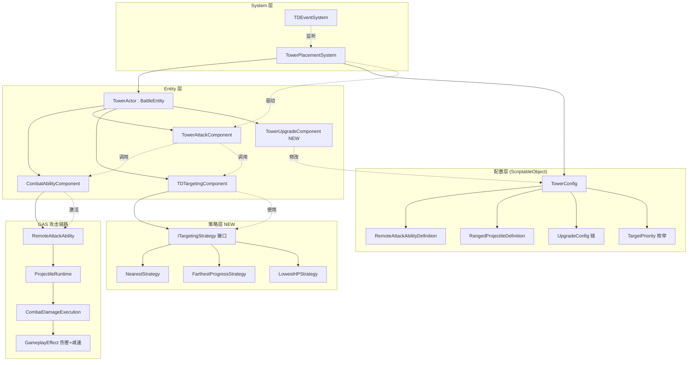
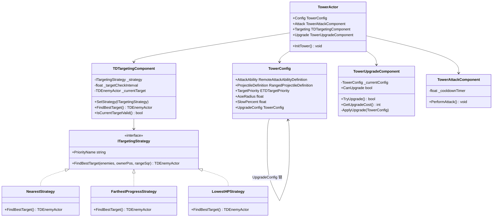
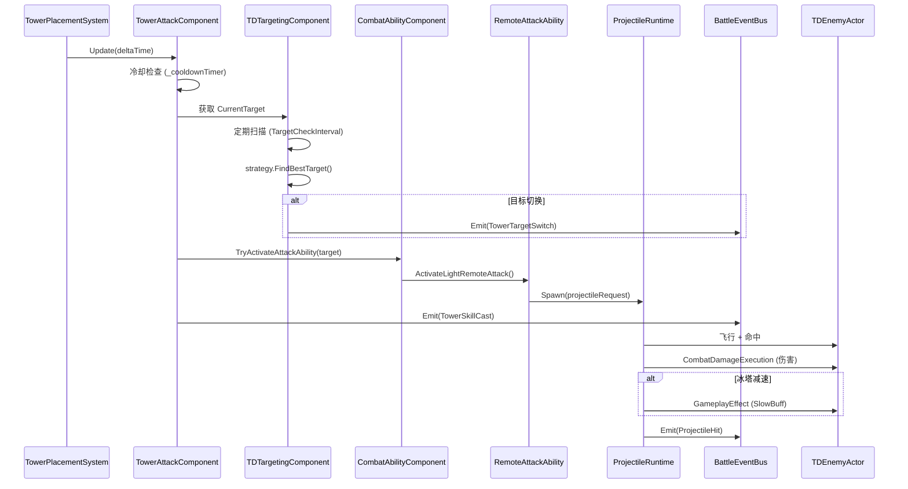

## 产品概述

在现有塔防项目 Phase 3 基础上，深化防御塔体系，实现三种差异化塔类型（箭塔/炮塔/冰塔），通过配置驱动塔行为，目标选择策略模式化，以及塔升级系统。

## 核心功能

### 一、防御塔类型系统

- **ArrowTower（箭塔）**：单体高频攻击，通过 RemoteAttackAbilityDefinition + 单体 RangedProjectileDefinition 配置驱动
- **CannonTower（炮塔）**：AOE 爆炸攻击，通过 RemoteAttackAbilityDefinition + 带爆炸半径的 RangedProjectileDefinition 配置驱动
- **IceTower（冰塔）**：减速控制，通过 RemoteAttackAbilityDefinition + 带 Slow 效果的 GameplayEffectDefinition 配置驱动
- 严格禁止在 TowerActor 内部写死任何类型逻辑，完全由 TowerConfig 的 AttackAbility / ProjectileDefinition 字段驱动差异化行为

### 二、塔技能化

- 所有攻击通过 CombatAbilityComponent.TryActivateAttackAbility() → GAS 投射物链路执行
- 冰塔减速效果通过 GameplayEffectDefinition（SlowEffect）在命中时施加，不在 TowerActor 中写 Buff 逻辑
- 炮塔 AOE 通过 ProjectileRuntime 的爆炸半径机制自然扩散，不在 TowerActor 中计算范围伤害
- TowerActor 保持纯粹：仅作为 Entity 容器和配置持有者，不包含伤害计算、Buff 施加、类型判断逻辑

### 三、塔升级系统

- 新增 TowerUpgradeComponent（EntityComponent），从 TowerActor 中解耦升级逻辑
- 支持 Lv1 → Lv2 → Lv3 三级升级链，通过 TowerConfig.UpgradeConfig 链式引用配置
- 每级改变：AttackDamage、AttackInterval、AttackAbility（可选切换技能）、ProjectileDefinition
- 升级触发 TowerUpgraded 事件，由 TDEventSystem 统计

### 四、目标选择策略升级

- 将 TDTargetingComponent 中的 switch-case 替换为策略模式（ITargetingStrategy 接口）
- 支持三种策略：Nearest（最近目标）、FarthestProgress（路径最远/最靠近主城）、LowestHP（血量最低）
- 移除旧枚举 PriorityBoss（Boss 优先级合并到通用策略中，或作为配置选项）
- 策略可运行时切换（通过 TowerConfig.TargetPriority 配置驱动）
- 新策略可自由扩展（实现 ITargetingStrategy 即可），无需修改 TDTargetingComponent

### 五、事件扩展

- 新增事件 ID：TowerSkillCast(6016)、TowerTargetSwitch(6017)
- 新增 event struct：TowerSkillCastEvent、TowerTargetSwitchEvent
- TDEventSystem 订阅新事件并聚合数据
- 投影物命中事件（ProjectileHit=6015）中补充技能信息

### 六、性能保障

- TDTargetingComponent 继续保持 TargetCheckInterval（0.3s）非每帧扫描
- 修复 TowerAttackComponent.Update() 中重复调用 _targeting.Update() 的双重驱动问题
- TowerAttackComponent 保持冷却计时器驱动，不做每帧攻击判定
- 投射物对象池由 ProjectileRuntime 已有机制保障，不新增重复池

## 技术栈

- 语言：C#（Unity）
- 框架：BattleEngine / BattleContext / GAS（Gameplay Ability System）
- 组件模式：Entity-Component（BattleEntity + EntityComponent）
- 事件系统：BattleEventBus 泛型事件
- 策略模式：ITargetingStrategy 接口

## 实现策略

### 总体思路

Phase 4 的核心是 **配置驱动 + 策略模式化**。当前 TowerActor 已经相对干净（无硬编码伤害），主要改造在于：

1. TDTargetingComponent 从 switch-case 改造为策略模式
2. 将 TowerActor.Upgrade() 中的升级逻辑抽取为独立的 TowerUpgradeComponent
3. 扩展 TowerConfig 以支持 AOE/Slow/Buff 效果配置
4. 新增事件类型并接入 TDEventSystem
5. 修复双重 Update 调用问题

### 塔类型差异化方案

不创建 ArrowTower/CannonTower/IceTower 子类，而是通过 TowerConfig 不同配置区分：

- **ArrowTower 配置**：AttackAbility = 标准 RemoteAttackAbilityDefinition，ProjectileDefinition = 直线单目标投射物，AoeRadius=0，SlowPercent=0
- **CannonTower 配置**：AttackAbility = AOE RemoteAttackAbilityDefinition，ProjectileDefinition = 抛物线+爆炸半径投射物，AoeRadius=3f
- **IceTower 配置**：AttackAbility = 减速 RemoteAttackAbilityDefinition，DamageEffect 中包含 SlowEffect，SlowPercent=0.5f

## 架构设计

### 系统架构图



### 类关系图



### Skill 驱动战斗流程图



## 目录结构

```
Assets/Scripts/HotUpdate.Core/Battle/TowerDefense/
├── Core/
│   └── TDTypes.cs                    # [MODIFY] 新增 TDEventIds: TowerSkillCast(6016), TowerTargetSwitch(6017)
│                                     #          新增 struct: TowerSkillCastEvent, TowerTargetSwitchEvent
│                                     #          修改 ETDTargetPriority 枚举（移除 PriorityBoss，新增 FarthestProgress, LowestHP）
├── Tower/
│   ├── TowerActor.cs                 # [MODIFY] 移除 Upgrade() 方法，改为集成 TowerUpgradeComponent
│   │                                 #          InitTower() 中注册 TowerUpgradeComponent
│   ├── TowerConfig.cs                # [MODIFY] 新增字段: SlowEffect (GameplayEffectDefinition)
│   │                                 #          TargetPriority 类型改为 ETDTargetPriority（新枚举值）
│   ├── TowerAttackComponent.cs       # [MODIFY] 修复 _targeting.Update() 双重调用
│   │                                 #          PerformAttack() 中发射 TowerSkillCast 事件
│   │                                 #          移除对 _targeting.Update() 的手动调用
│   ├── TDTargetingComponent.cs       # [MODIFY] 重构为策略模式
│   │                                 #          新增 SetStrategy(ITargetingStrategy)
│   │                                 #          目标切换时发射 TowerTargetSwitch 事件
│   ├── TowerPlacementSystem.cs       # [MODIFY] 升级逻辑委托给 TowerUpgradeComponent
│   │                                 #          Update() 中改为驱动 tower.Upgrade?.Update()
│   ├── TowerUpgradeComponent.cs      # [NEW] 防御塔升级组件
│   │                                 #          实现等级变化逻辑、配置替换、属性更新、Gold 消费
│   │                                 #          升级后发射 TowerUpgraded 事件
│   └── TargetingStrategy/
│       ├── ITargetingStrategy.cs     # [NEW] 目标选择策略接口
│       │                             #         FindBestTarget(enemies, owner, rangeSqr) 方法
│       ├── NearestStrategy.cs        # [NEW] 最近目标策略
│       ├── FarthestProgressStrategy.cs # [NEW] 路径进度最大策略
│       └── LowestHPStrategy.cs        # [NEW] 血量最低策略
├── Event/
│   └── TDEventSystem.cs              # [MODIFY] 订阅 TowerSkillCast、TowerTargetSwitch
│                                     #          聚合 SkillCastCount、TargetSwitchCount 统计
├── Config/
│   └── TowerDefenseGlobalConfig.cs   # [MODIFY] 可能新增预定义塔策略映射表
└── Core/
    └── TDBattleEngine.cs             # [MODIFY] 可能需要预注册塔策略工厂（可选）
```

## 关键代码结构

### ITargetingStrategy 接口

```
namespace TowerDefense
{
    /// <summary>
    /// 目标选择策略接口 —— 策略模式，支持运行时切换和未来扩展
    /// </summary>
    public interface ITargetingStrategy
    {
        /// <summary>策略名称（用于调试/UI）</summary>
        string StrategyName { get; }

        /// <summary>
        /// 在候选敌人列表中寻找最佳目标
        /// </summary>
        /// <param name="enemies">候选敌人列表（已按阵营过滤）</param>
        /// <param name="owner">防御塔自身</param>
        /// <param name="rangeSqr">攻击距离平方（调用方预计算）</param>
        /// <returns>最佳目标，无有效目标返回 null</returns>
        TDEnemyActor FindBestTarget(IReadOnlyList<BattleEntity> enemies, BattleEntity owner, float rangeSqr);
    }
}
```

### TowerSkillCastEvent / TowerTargetSwitchEvent

```
/// <summary>防御塔技能施放事件</summary>
public readonly struct TowerSkillCastEvent
{
    public readonly int TowerId;
    public readonly int TargetId;
    public readonly int AbilityId;
    public readonly ETDTowerType TowerType;

    public TowerSkillCastEvent(int towerId, int targetId, int abilityId, ETDTowerType towerType)
    {
        TowerId = towerId;
        TargetId = targetId;
        AbilityId = abilityId;
        TowerType = towerType;
    }
}

/// <summary>防御塔切换目标事件</summary>
public readonly struct TowerTargetSwitchEvent
{
    public readonly int TowerId;
    public readonly int PreviousTargetId; // -1 表示之前无目标
    public readonly int NewTargetId;       // -1 表示丢失目标
    public readonly string StrategyName;

    public TowerTargetSwitchEvent(int towerId, int prevTargetId, int newTargetId, string strategyName)
    {
        TowerId = towerId;
        PreviousTargetId = prevTargetId;
        NewTargetId = newTargetId;
        StrategyName = strategyName;
    }
}
```

## 实现注意事项

### 性能关键点

- **TDTargetingComponent**：保留 TargetCheckInterval（默认 0.3s）非每帧扫描；策略模式不影响性能（接口调用开销可忽略）
- **TowerAttackComponent**：保持 _cooldownTimer 驱动；移除 `_targeting.Update(deltaTime)` 调用，改为由 TowerPlacementSystem 统一驱动
- **TowerPlacementSystem.Update()**：改为同时驱动 `tower.Attack?.Update()` 和 `tower.Targeting?.Update(deltaTime)`，消除双重调用
- **缓存**：TDTargetingComponent 继续缓存 _currentTarget，仅在 IsCurrentTargetValid() 失败或超时后重新扫描

### 兼容性

- TowerConfig 新增字段使用 SerializeField + 默认值，保持与现有 .asset 文件兼容
- ETDTargetPriority 旧值 Nearest/MostProgressed/PriorityBoss 用 Obsolete 标记或直接保留并新增（保留兼容性）
- 策略模式从旧 switch-case 平滑迁移，TargetingComponent 构造时根据旧枚举值创建对应策略对象

### 日志

- TowerTargetSwitch 事件仅在目标真正变化时发射（前目标 != 新目标）
- TowerSkillCast 事件在每次 PerformAttack() 成功时发射
- 使用现有 Debug.Log 模式，不引入新日志框架

## Agent Extensions

### Skill

- **battle**
- Purpose: 塔防项目基于 BattleFoundation 和 BattleCommon/GAS 框架，所有新增组件（TowerUpgradeComponent）需遵循 EntityComponent 模式，攻击链路对接 CombatAbilityComponent 和 RemoteAttackAbilityDefinition，事件系统对接 BattleEventBus
- Expected outcome: 确保新增代码与现有 BattleEngine / GAS / EventBus 框架完全对齐，遵循已有的 EntityComponent 生命周期、IBattleSystem 注册模式、泛型事件订阅模式

### SubAgent

- **code-explorer**
- Purpose: 补充探索 GAS 系统中 GameplayEffectDefinition 的 Slow/Buff 实现模式、CombatAttributeComponent 的 MoveSpeed 属性、ProjectileRuntime 的 AOE 爆炸处理逻辑
- Expected outcome: 获取 SlowEffect 配置方式、AOE 投射物爆炸半径的现有处理机制、以及 RemoteAttackAbilityDefinition 的完整配置项，确保冰塔减速和炮塔 AOE 方案可行