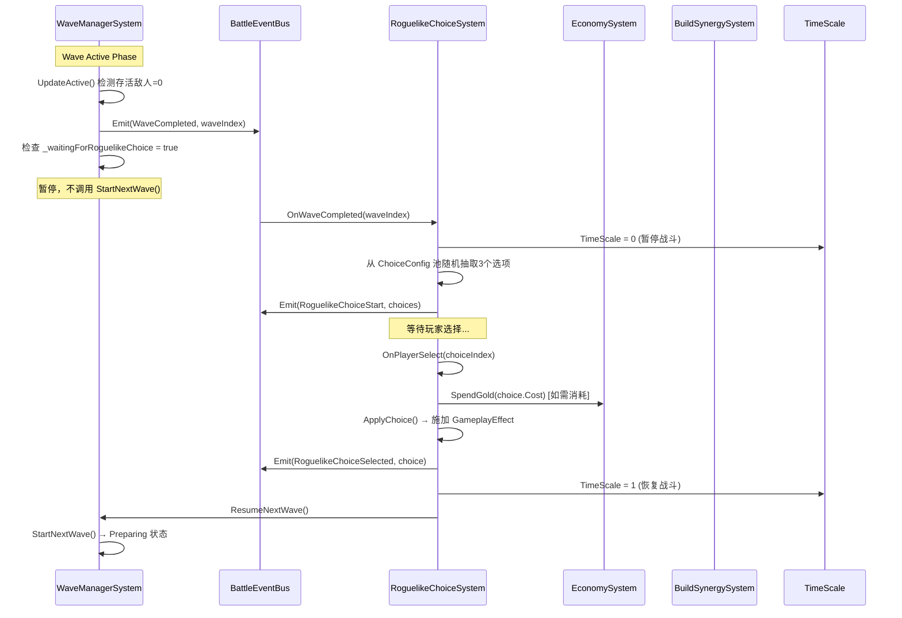
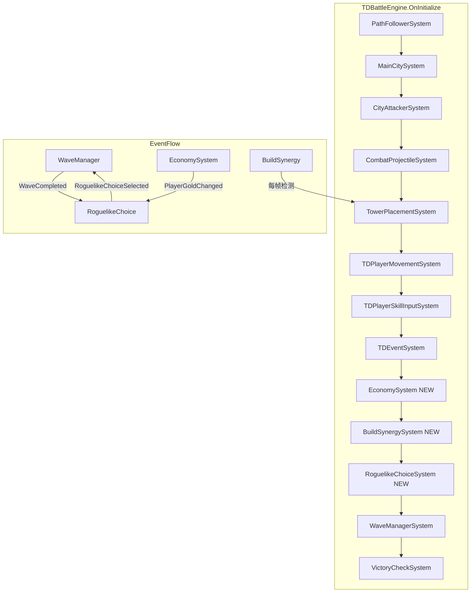
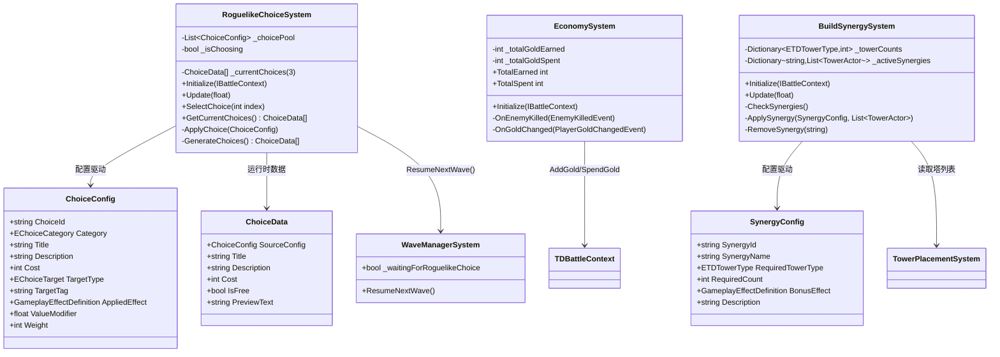

## 产品概述

在现有塔防项目基础上，新增 Roguelike 构筑玩法层，使固定的塔防升级为"局内Build策略游戏"。核心机制：每波次清除后暂停战斗，提供3个随机强化选项供玩家选择，选择后效果通过 GAS GameplayEffect 系统施加。同时完善经济系统（敌人击杀奖励金币）和 Build 流派系统（同类型塔数量触发协同加成）。

## 核心功能

### 1. Roguelike强化选择系统

- 每波清除后自动触发选择阶段，TimeScale 设为 0 暂停战斗
- 每次从配置池中随机抽取3个选项展示给玩家
- 选项类型：塔强化（攻速/范围/减速增强）、技能强化（伤害/冷却/附加buff）、属性强化（玩家攻击/主城回血/金币掉落）
- 玩家选择后通过 GAS GameplayEffect 立即生效，恢复 TimeScale，推进下一波
- 所有选项必须通过 ScriptableObject 配置驱动，新增类型只需扩展配置资产而非修改代码

### 2. 局内经济系统

- 敌人击杀自动获得金币（金额来自 EnemyConfig）
- 建塔、升级消耗金币（复用现有 `TDBattleContext.SpendGold`）
- 强化选择可配置为免费或消耗金币
- 所有经济变更必须通过 `PlayerGoldChanged` BattleEvent 发射
- 支持未来商店系统扩展

### 3. Build流派协同系统

- 实时统计同类型塔数量，达到阈值自动应用协同增益（如3个箭塔=攻速+20%）
- 协同规则通过 SynergyConfig ScriptableObject 配置，用 Tag 驱动匹配
- 增益效果通过 GAS GameplayEffect 施加到对应塔上
- 塔被出售或摧毁时自动移除对应协同增益

### 4. 事件系统扩展

- 新增 `WaveCompleted`(6018)：波次彻底清除，在选择阶段前触发
- 新增 `RoguelikeChoiceStart`(6019)：选择面板打开
- 新增 `RoguelikeChoiceSelected`(6020)：玩家做出选择
- 复用 `PlayerGoldChanged`(6012) 作为 `OnEconomyChanged`

### 5. UI数据层

- 仅输出数据结构，供UI层对接：选项类型、标题、描述、消耗金币、预览效果参数

## 技术栈

- C# (.NET Standard 2.1 / Unity 2022+)
- BattleFoundation 框架（IBattleSystem、BattleContext、BattleEventBus）
- GAS（GameplayAbilitySystem）：GameplayEffectDefinition 施加强化效果
- ScriptableObject 数据驱动配置
- 现有 TowerDefense 命名空间架构

## 实现方案

### 核心设计决策

**1. 波次拦截点设计**
当前 `WaveManagerSystem.UpdateActive()` 在检测到存活敌人=0后，立即发射 `WaveCleared(6002)` 并调用 `StartNextWave()`。为避免大规模重写 WaveManager，采用最小改动方案：

- `UpdateActive()` 中新增发射 `WaveCompleted(6018)` 事件
- 新增 `_waitingForRoguelikeChoice` 标志位，若为 true 则不自动调用 `StartNextWave()`
- `RoguelikeChoiceSystem` 监听到 `WaveCompleted` 后暂停 TimeScale，生成选项
- 玩家选择完成后，`RoguelikeChoiceSystem` 调用 `WaveManager.ResumeNextWave()` 恢复流程

**2. 选项数据驱动架构**

- `ChoiceConfig` (ScriptableObject) 定义单个选项模板：类别、标题、描述、消耗金币、目标标签、施加的 GameplayEffectDefinition、随机权重
- `ChoiceData` (struct) 为运行时选择实例，包含从配置中解析的参数
- `RoguelikeChoiceSystem` 在初始化时加载所有 `ChoiceConfig` 资产，每次按权重随机抽取3个

**3. 协同系统Tag驱动**

- `SynergyConfig` (ScriptableObject)：定义塔类型、需求数量、协同效果 GameplayEffectDefinition
- `BuildSynergySystem` 维护每帧更新的塔类型计数器，达到阈值时对符合条件的塔施加/移除 GameplayEffect

**4. GAS集成方式**
前三阶段已建立完整的 GAS 链路（CombatAbilityComponent → RemoteAttackAbility → ProjectileRuntime → CombatDamageExecution）。强化效果通过 `GameplayEffectDefinition` 直接施加到目标 Entity 的 `CombatAttributeComponent` 上，无需新增 Ability 类型。

### 架构图

#### 系统数据流



#### 系统注册顺序



#### 类关系图



## 目录结构

```
Assets/Scripts/HotUpdate.Core/Battle/TowerDefense/
├── Roguelike/
│   ├── Choice/
│   │   ├── RoguelikeChoiceSystem.cs   # [NEW] 强化选择系统 (IBattleSystem)
│   │   │                               职责：监听WaveCompleted事件，暂停TimeScale，
│   │   │                               随机生成3个ChoiceData，等待玩家选择，
│   │   │                               施加GameplayEffect，恢复TimeScale并推进波次
│   │   ├── ChoiceConfig.cs            # [NEW] 选择配置 ScriptableObject
│   │   │                               定义选项模板：类别/标题/描述/消耗/目标标签/
│   │   │                               GameplayEffect引用/随机权重
│   │   └── ChoiceData.cs             # [NEW] 运行时选择数据结构
│   │                                   包含ChoiceConfig引用、解析后的预览文本、
│   │                                   是否免费等UI层需要的数据
│   ├── Economy/
│   │   └── EconomySystem.cs           # [NEW] 经济管理系统 (IBattleSystem)
│   │                                   监听EnemyKilled事件计算击杀金币奖励，
│   │                                   统计总收入/总支出，通过TDBattleContext操作金币
│   └── Synergy/
│       ├── BuildSynergySystem.cs       # [NEW] 流派协同系统 (IBattleSystem)
│       │                               每帧统计塔类型数量，达到阈值时施加/移除
│       │                               GameplayEffect，支持出售/摧毁塔时自动移除
│       └── SynergyConfig.cs           # [NEW] 协同配置 ScriptableObject
│                                       定义协同规则：塔类型/需求数量/增益GameplayEffect
├── Core/
│   └── TDTypes.cs                     # [MODIFY]
│   ├── TDEventIds: +WaveCompleted=6018, +RoguelikeChoiceStart=6019,
│   │   +RoguelikeChoiceSelected=6020
│   ├── +EChoiceCategory 枚举 (TowerBuff/SkillBuff/AttributeBuff)
│   ├── +EChoiceTarget 枚举 (按塔类型/玩家/主城/全局)
│   ├── +ChoiceSelectedEvent struct
│   └── +RoguelikeChoiceStartEvent struct
├── Wave/
│   └── WaveManagerSystem.cs           # [MODIFY]
│   ├── +_waitingForRoguelikeChoice 标志位
│   ├── UpdateActive(): +发射 WaveCompleted 事件
│   ├── UpdateActive(): 检查标志位决定是否自动 StartNextWave()
│   └── +ResumeNextWave() 新方法
├── Config/
│   └── TowerDefenseGlobalConfig.cs    # [MODIFY]
│   └── +RoguelikeChoicePool: ChoiceConfig[] 引用
│   └── +SynergyConfigs: SynergyConfig[] 引用
└── Event/
    └── TDEventSystem.cs              # [MODIFY]
    └── +订阅 WaveCompleted/RoguelikeChoiceStart/RoguelikeChoiceSelected
    └── +ChoiceCount 统计
```

## 关键代码结构

### 新增事件ID与枚举

```
// TDTypes.cs 追加
public static class TDEventIds
{
    // ... 现有 6001-6017 ...
    public const int WaveCompleted          = 6018;
    public const int RoguelikeChoiceStart   = 6019;
    public const int RoguelikeChoiceSelected = 6020;
}

public enum EChoiceCategory
{
    TowerBuff,      // 塔强化类
    SkillBuff,      // 技能强化类
    AttributeBuff,  // 属性强化类
}

public enum EChoiceTarget
{
    ArrowTower,
    CannonTower,
    MageTower,
    IceTower,
    AllTowers,
    Player,
    MainCity,
    Global,
}

public readonly struct RoguelikeChoiceStartEvent
{
    public readonly int WaveIndex;
    public readonly int ChoiceCount; // 固定3

    public RoguelikeChoiceStartEvent(int waveIndex, int choiceCount)
    {
        WaveIndex = waveIndex;
        ChoiceCount = choiceCount;
    }
}

public readonly struct ChoiceSelectedEvent
{
    public readonly int WaveIndex;
    public readonly string ChoiceId;
    public readonly EChoiceCategory Category;
    public readonly int CostPaid;

    public ChoiceSelectedEvent(int waveIndex, string choiceId,
        EChoiceCategory category, int costPaid)
    {
        WaveIndex = waveIndex;
        ChoiceId = choiceId;
        Category = category;
        CostPaid = costPaid;
    }
}
```

### ChoiceConfig ScriptableObject 接口

```
// ChoiceConfig.cs
public class ChoiceConfig : ScriptableObject
{
    // 唯一标识
    public string ChoiceId;
    // 类别
    public EChoiceCategory Category;
    // 展示标题
    public string Title;
    // 展示描述
    public string Description;
    // 消耗金币（0=免费）
    public int Cost;
    // 目标过滤
    public EChoiceTarget TargetType;
    // 额外标签过滤（如 "ArrowOnly", "SlowSpecialist"）
    public string TargetTag;
    // 施加的GAS效果
    public GameplayEffectDefinition AppliedEffect;
    // 数值修饰（如1.3表示攻速+30%）
    public float ValueModifier;
    // 随机权重
    public int Weight;
    // 前置条件标签（如需要已有IceTower才出现此选项）
    public string[] RequiredTags;
}
```

### WaveManagerSystem 改动要点

```
// WaveManagerSystem.cs 关键改动
private bool _waitingForRoguelikeChoice;

private void UpdateActive()
{
    int aliveEnemies = _entityManager.AliveCountByCamp(EEntityCamp.Enemy);
    if (aliveEnemies <= 0)
    {
        State = ETDWaveState.Cleared;
        _context.EventBus.Emit(TDEventIds.WaveCleared, CurrentWaveIndex);
        _context.EventBus.Emit(TDEventIds.WaveCompleted, CurrentWaveIndex); // NEW
        
        if (!_waitingForRoguelikeChoice)
            StartNextWave();
    }
}

public void ResumeNextWave()
{
    _waitingForRoguelikeChoice = false;
    StartNextWave();
}
```

## 性能与约束说明

- **TimeScale 控制**：选择阶段通过 `IBattleContext.RuntimeSettings.TimeScale = 0` 暂停所有 Update 驱动，避免额外 if 判断
- **协同检测频率**：BuildSynergySystem 仅在塔数量变化时（建造/出售/升级）触发重算，而非每帧全量扫描
- **事件零GC**：新增事件 struct 均为只读值类型，栈分配
- **配置资产隔离**：所有 Roguelike 配置独立为 ScriptableObject 资产文件，不侵入现有配置
- **系统解耦**：三个新系统均通过 EventBus 通信，无直接依赖

## Agent Extensions

### Skill

- **battle**
- 用途：确保所有 GameplayEffect 施加代码遵循现有 GAS 链路规范（CombatAttributeComponent + GameplayEffectDefinition 模式），与 Phase 3-4 的 AttackAbility/Projectile/SlowEffect 模式保持一致
- 预期结果：RoguelikeChoiceSystem 和 BuildSynergySystem 中施加 GameplayEffect 的代码与现有战斗框架完全兼容，正确使用 `IBattleContext.EntityManager` 获取目标 Entity 的 `CombatAttributeComponent` 并应用效果